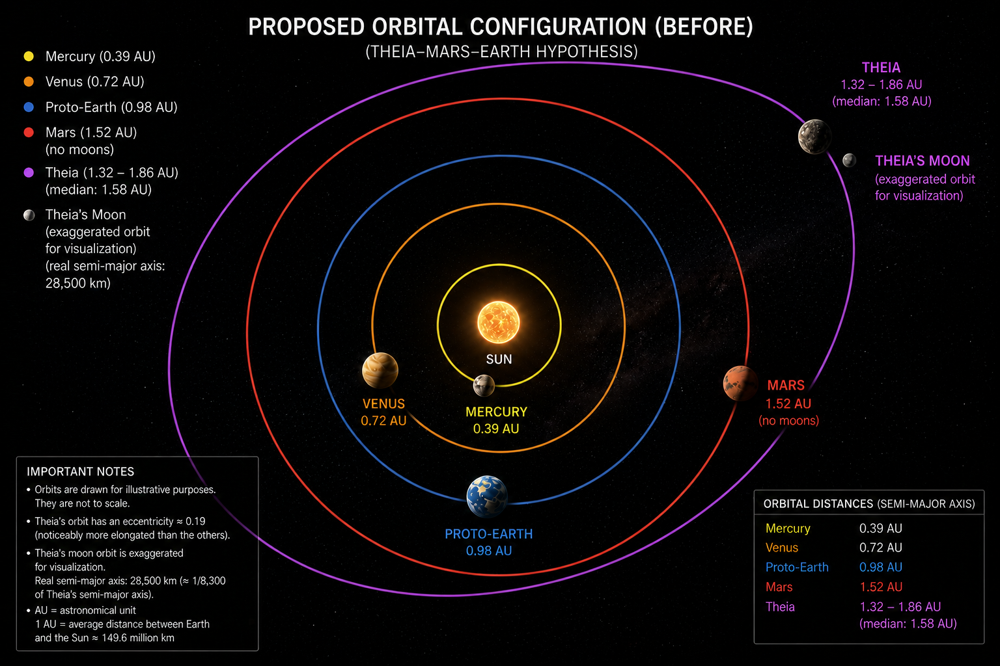
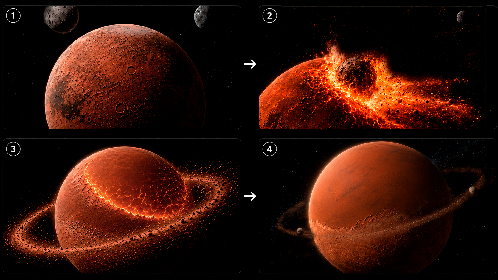
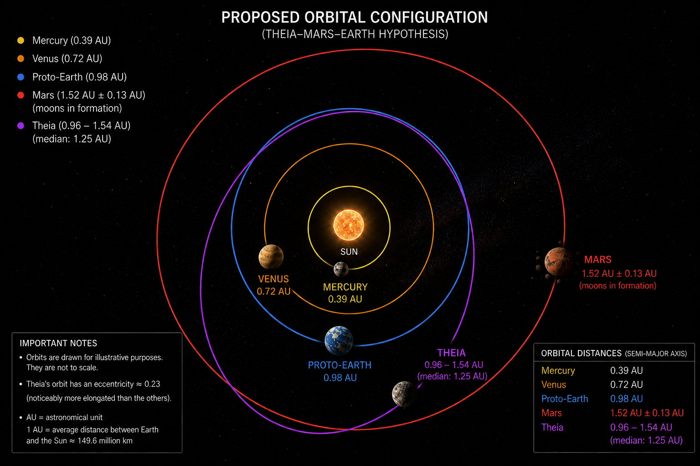
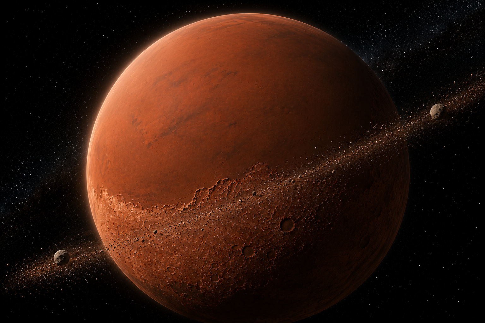
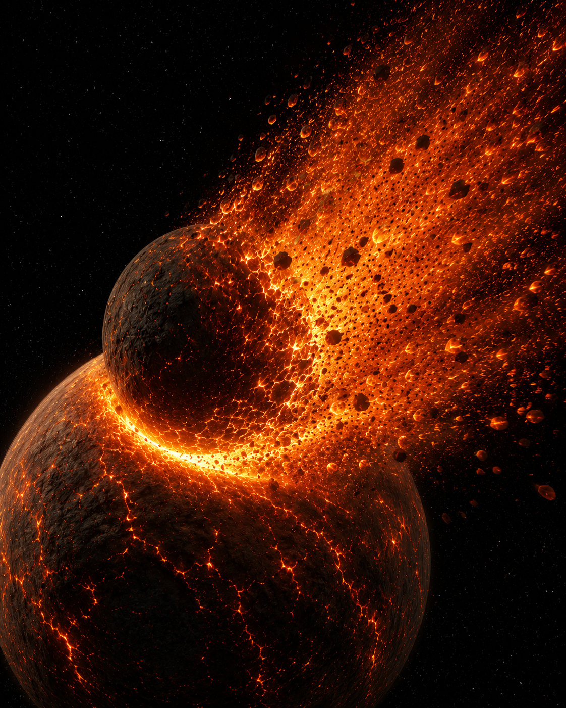

# Figures

Scenario illustrations for the Elara Hypothesis.

---

## Before the encounter

Theia's orbit is visibly eccentric (e ≈ 0.19) and reaches Mars's orbit at
aphelion. The satellite's orbit is exaggerated for visibility — its true
semi-major axis is 28,500 km, about 1/8,300 of Theia's.

---

## The Borealis impact

Roughly one to three minutes after contact. The satellite (2,000 km across,
about a third of Mars's diameter) is partly buried; ejecta streams downrange,
as an oblique impact requires. The Borealis basin itself is not yet visible —
excavation takes about 28 minutes, and the finished basin spans 10,600 km,
wider than the planet.

---

## After the encounter

Theia now crosses both Earth's and Mars's orbits (0.96–1.54 AU). Mars carries
a debris disc. Shown is the 22 % branch; in the remaining 78 % Theia keeps a
perihelion near 1.39 AU and cannot reach Earth.

---

## The permanent scar

Mars billions of years later. The northern hemisphere is a vast smooth
lowland plain, sharply bounded against ancient cratered highlands along a
kilometres-high escarpment — the Martian dichotomy. Two small irregular
moons orbit in the tilted plane of the original impact, with a faint remnant
ring between them. The Borealis basin has no visible rim: at 10,600 km across
it is wider than the planet, and its edge lies beyond the horizon.

---

## The Moon-forming impact

A different class of event from Borealis. Theia is slightly more than half
the proto-Earth's diameter and the collision is a hundred times more
energetic — two comparable worlds merging rather than a body striking a
planet.

Theia does not survive. Her leading hemisphere has already disintegrated into
the plume, and that vaporised material is what will become the Moon. The
proto-Earth carries no oceans and no continents at this stage: a young, partly
molten world under a dense CO₂ and steam atmosphere.

The contrast between this image and the Borealis impact above is the point.
One projectile buries itself and leaves a scar on a planet that survives; the
other destroys itself and leaves a satellite where a world used to be.

| | Borealis | Moon-forming |
|---|---|---|
| projectile / target diameter | 0.30 | **0.55** |
| mass ratio | 1 : 50 | **1 : 9** |
| energy | 2.7 × 10²⁹ J | **3.0 × 10³¹ J** |
| projectile survives | buried intact | **destroyed** |

---

## Notes on physical accuracy

- Mars is shown with surface ice rather than oceans. At 4.5 Ga the Sun was
  ~70 % as luminous, giving Mars an equilibrium temperature near 190 K.
  Liquid water would require a substantial greenhouse; ice does not.
- Theia is shown dark and basaltic. Forming inside the snow line, she would
  be volatile-poor and low-albedo, not reddish or icy.
- The Borealis impact vaporises roughly 58 Earth-oceans' worth of ice — any
  surface ice is removed globally.
- The debris disc lies in the plane of the oblique impact, not in Mars's
  equatorial plane. Because the same impact reconfigured Mars's rotation,
  that plane is what later becomes the equator.
- The proto-Earth is shown without oceans. At 4.5 Ga it retained accretional
  heat and a dense CO₂–steam atmosphere; liquid water oceans came later.
